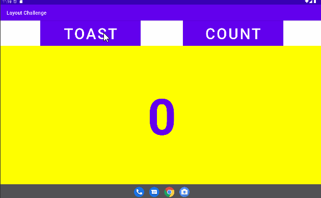

# -The-layout-editor
Tasks challenges and homework
 

Layout editor in relative layout 

A RelativeLayout is a view grouping in which each view is positioned and aligned relative to other views within the group. In this task you will learn how to build a layout with RelativeLayout.

 

Layout editor in relative layout in landscape 

 

Layout editor in relative layout x-large(tablet variation) 

 
 

<b>Layout editor in linear layout</b> 

LinearLayout is a ViewGroup that arranges its collection of views in a horizontal or vertical row. A LinearLayout is one of the most common layouts because it is simple and fast. It is often used within another view group to arrange UI elements horizontally or vertically.

 

<b>The layout editor challenges</b> 

 The layout editor challenger is to accommodate horizontal (landscape) orientation for a tablet, you can center the Button elements in activity_main.xml (xlarge) so that they appear as shown in the figure below.

 

Layout editor homework 

Align the Toast and Count Button elements along the left side of the show_count TextView that shows "0". Include a third Button called Zero that appears between the Toast and Count Button elements.
Distribute the Button elements vertically between the top and bottom of the show_count TextView.
Set the Zero Button to initially have a gray background.Make the Zero Button change the value in the show_count TextView to 0.
Update the click handler for the Count Button so that it changes its own background color, depending on whether the new count is odd or even.
Update the click handler for the Count Button to set the background color for the Zero Button to something other than gray to show it is now active. Hint: You can use findViewById in this case.
Update the click handler for the Zero Button to reset the color to gray, so that it is gray when the count is zero.

 

Layout editor homework in landscape view 

 

Layout editor homework in x-large(tablet variation)view 

 

<b>Question 1</b> 

Which two layout constraint attributes on the Zero Button position it vertically equal distance between the other two Button elements? 
-> android:layout_marginBottom="8dp" 
-> android:layout_marginTop="8dp"

<b>Question 2</b> 

Which layout constraint attribute on the Zero Button positions it horizontally in alignment with the other two Button elements? 
  -> app:layout_constraintLeft_toLeftOf="parent"

<b>Question 3</b>

What is the correct signature for a method used with the android:onClick XML attribute? 
  -> public void callMethod(View view)

<b>Question 4</b>

The click handler for the Count Button starts with the following method signature: 
public void countUp(View view) 
Which of the following techniques is more efficient to use within this handler to change the Button element's background color? 
  -> Use the view parameter that is passed to the click handler with setBackgroundColor(): view.setBackgroundColor()

