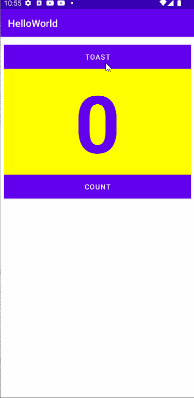
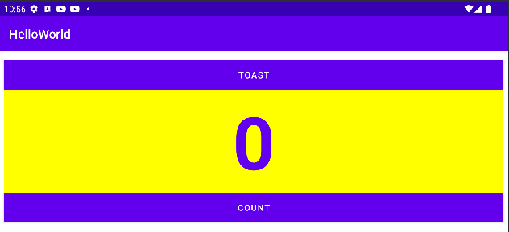
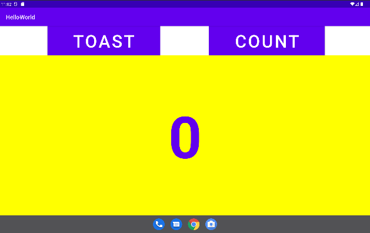
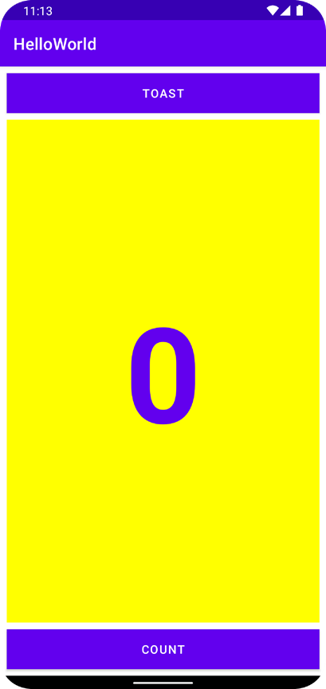
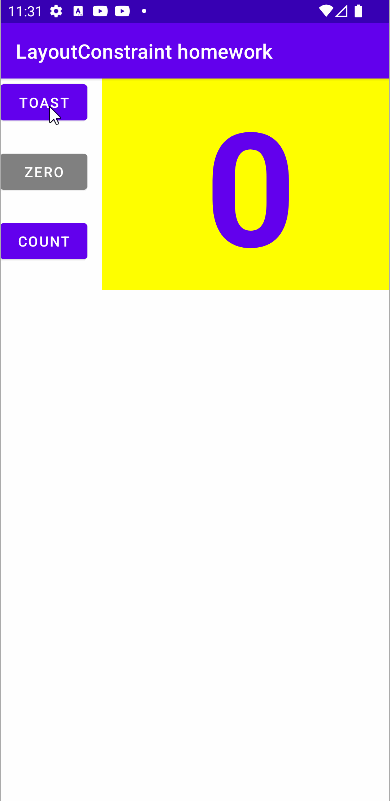
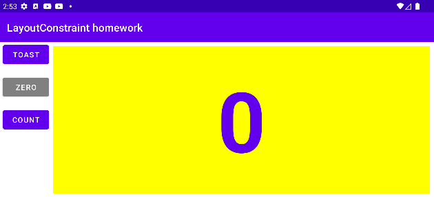
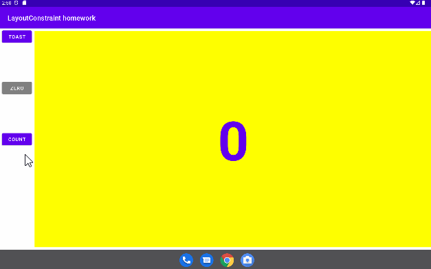

# -The-layout-editor
Tasks challenges and homework
 
Layout editor in relative layout 
 
Layout editor in relative layout in landscape 
 
Layout editor in relative layout x-large(tablet variation) 
 
 
Layout editor in linear layout 
 

the layout editor challenges 
 

Layout editor homework 
 
Layout editor homework in landscape view 
 
Layout editor homework in x-large(tablet variation)view 
 

